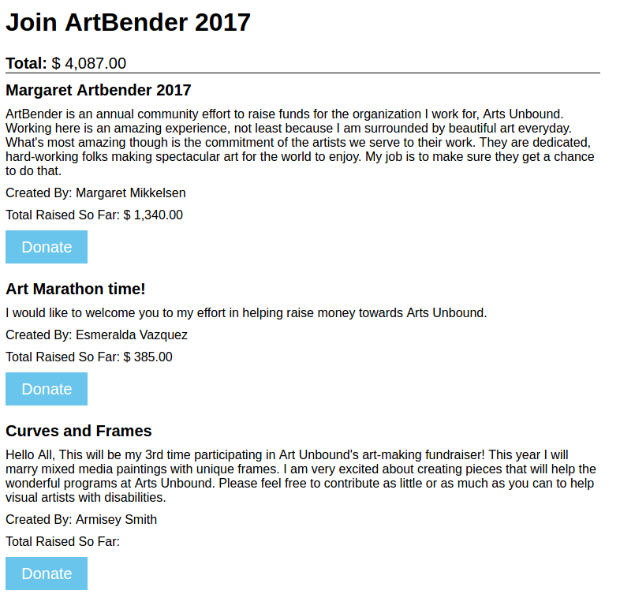

README
------
This plugin creates a shortcode that lists Civi Personal Campaign Pages for a contribution page or event page, see screenshot example below.

The short code will also print the name of the event at the top of the page as well as the total raised for this event so far (pcp and thru the event page itself).

The shortcode also creates a search box where one can search by any part of the pcp creators display name.

### Parameters that must be passed to the shortcode:

+ page_type: either event or contribute
+ page_id: civiCRM event id or contribution id,

Example of the basic shortcode: `[civipcp_shortcode page_id=1 page_type='event']`

### Optional Paramaters:

In addition to the required parameters one may pass the following fields to the short code as shown in the example below to have them show up.

Example of how to pass optional parameters: `[civipcp_shortcode page_id=1 page_type='event' title=1 intro_text=1 contact_id=1]`

+ title: PCP Title, will show bolded with default styles
+ goal_amount
+ intro_text: called "welcome" in the ui
+ page_text: called "message" in the ui
+ contact: will show the contacts display name
+ campaign_id: id of campaign to include contributions to to in the total amount raised overall
